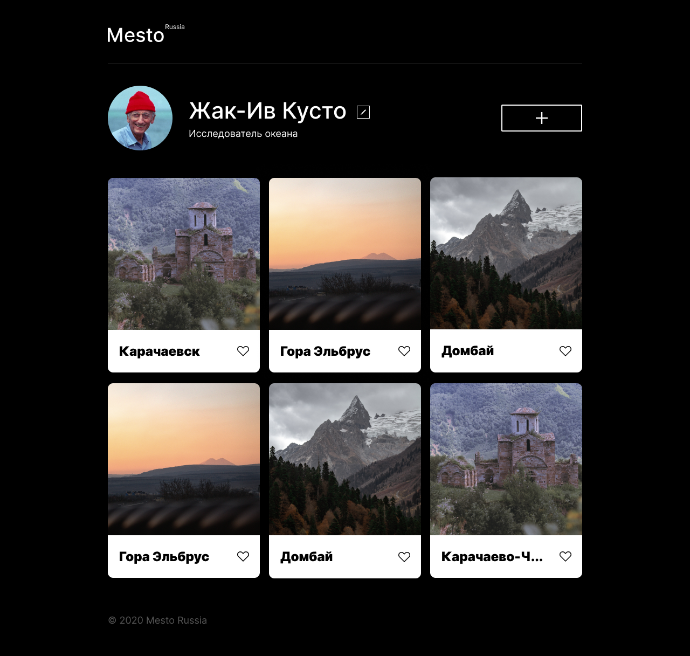
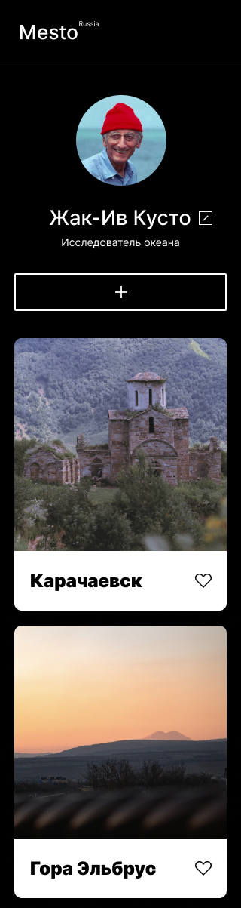

# Mesto
Mesto - это ученый проект из двух частей: frontend и backend. 

Backend представляет собой REST API, а frontend SPA на React.


| Desktop                                                  | Mobile                                                   |
|----------------------------------------------------------|----------------------------------------------------------|
|  |  |

## Основной функционал
 - регистрация и авторизация,
 - создание и удаление и карточки,
 - просмотр всех загруженных карточек,
 - постановка и снятие лайка,
 - обновление персональных данных пользователя и аватара,
 - открытие фотографии из карточки в полноэкранном режиме.

## Технологии
#### Frontend:
 - [HTML5](https://www.w3.org/TR/2011/WD-html5-20110405/)
 - [CCS3](https://www.w3.org/Style/CSS/specs.ru.html)
 - [JavaScript (ES6)](https://262.ecma-international.org/6.0/)
 - [Create React App](https://create-react-app.dev/)
 - [React](https://ru.legacy.reactjs.org/)
 - [БЭМ]()
 - [Webpack]()

#### Backend:
 - [Node.js](https://nodejs.org/ru)
 - [mongoDB](https://www.mongodb.com/)
 - [express.js](https://expressjs.com/ru/)
 - [mongoose](https://mongoosejs.com/)
 - [celebrate](https://www.npmjs.com/package/celebrate)

## Разработка

### Требования
Для установки и запуска проекта, необходим [NodeJS](https://nodejs.org/) v8+.

### Установка зависимостей
Для установки зависимостей frontend и backend, необходимо перейти в соответстующие папки и выполните команду:
```sh
$ npm i
```

### Запуск Development сервера
Чтобы запустить сервер для разработки:
 - в папке backend выполните команду:
```sh
npm run dev
```
- в папке frontend выполните команду:
```sh
npm run start
```
